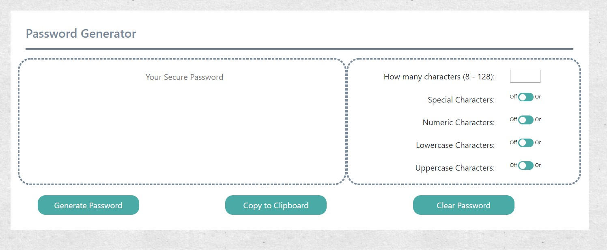
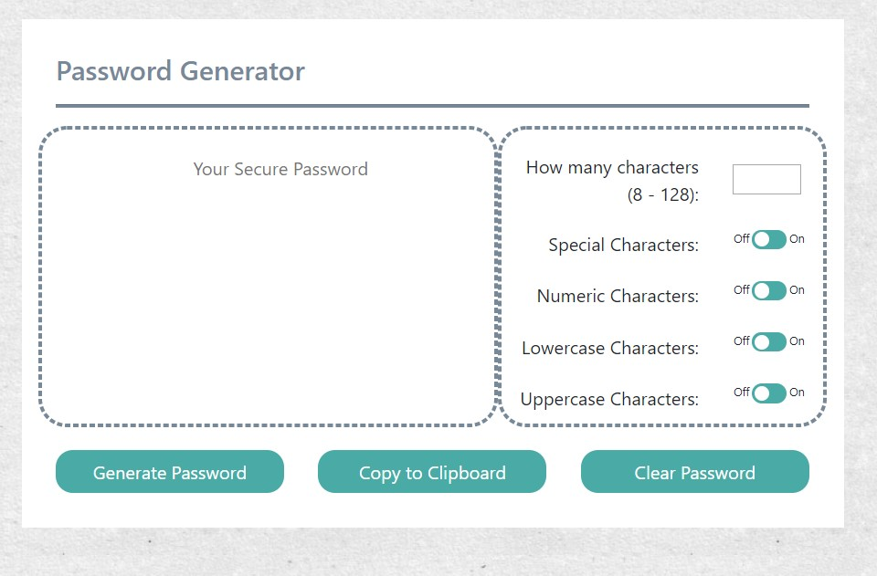

# Bootstrap-Portfolio
​
### Table of Contents
- [Description](#Description)
- [Technologies-Libraries](#Technologies-Libraries)
- [Screenshots](#Screenshots)
- [Link](#Link)
​
### Description
Basic password generator using random numbers, letters and special characters. This started with just a run through script. I made it into a function and used the button to start the gen process.

First iteration I used Prompts to collect the choices. I have made alterations to get the choices from HTML elements.
Second iteration I used an Array to hold my available options. 
Third itteration I changed that to an Object and I put the logic of the random character type in the Object as well. This simplified my loop that creates the random password. This makes the processing time faster as it does not have to pass through uneccesary if else statements.

I added the copy to clipboard function from a google search. I also did not like that the text stayed highlighted, so I found some lines to deselect the text after the copy.
​
### Technologies-Libraries
- [Bootstrap](https://getbootstrap.com/) - CSS Framework
​
### Screenshots
​

​

​
### Link
Check it out! 
https://chrisneal72.github.io/03_Password_Generator/